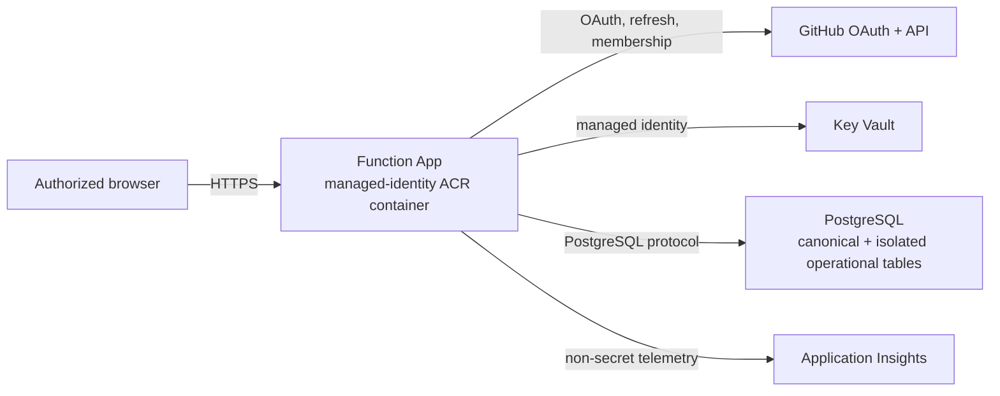

> [!WARNING]
> **Experimental:** The Azure deployment is an experimental baseline, not a turnkey or certified production service. Parameters, app settings, and resources can change between releases. Treat `server/azure/main.bicep`, the OAuth policy, the PostgreSQL topology, and the Key Vault access model as a starting point for your own review. Don't use the deployment with real users until your organization completes security, compliance, privacy, network, load, cost, monitoring, incident-response, backup, and rollback reviews.

## About the Azure deployment

The Azure deployment runs the Go dashboard server from the `server/` directory as a custom Linux container on Azure Functions. Browsers connect only to the Function App, over HTTPS on the same origin. The Function App:

- Signs users in with GitHub OAuth.
- Authorizes users by their membership in GitHub organizations or teams that you allow.
- Reads secrets through Key Vault references.
- Runs bounded [Dashboard Language](dashboard-language.md) queries against dashboard data in PostgreSQL.
- Uses a separate PostgreSQL operational adapter for sessions, rate limits, queues, deduplication, coordination, and bounded caches.



## Prerequisites

### Azure resources

The `server/azure/main.bicep` template creates the following resources in one resource group.

| Service | Configuration | Purpose |
| --- | --- | --- |
| Azure Functions | Linux custom-container Function App on runtime `~4`. HTTPS only, TLS 1.2 or later, FTPS off, always on, at least one instance, and a system-assigned managed identity. | Hosts the Go HTTP handler |
| Azure Container Registry | Basic SKU with the admin account disabled | Stores the Functions and bootstrap-ingestion images; the Function App pulls with managed identity |
| App Service plan | Elastic Premium `EP1` | Keeps the Function App always on |
| Key Vault | Role-based access control, 90-day soft delete, and purge protection | Stores the OAuth client secret, session secrets, PostgreSQL URL, and optional collection secrets |
| Storage account | `Standard_LRS`, HTTPS only, TLS 1.2, and no public blob access | Stores Azure Functions runtime state only |
| Application Insights | Optionally linked to a Log Analytics workspace | Collects operational telemetry that contains no secrets |

### Other requirements

- An Azure subscription and resource group where you can create these resources and assign the **Key Vault Secrets User** role.
- The Azure CLI with Bicep support.
- Docker, or an Azure Container Registry build agent.
- A GitHub OAuth app. Personal access tokens and GitHub App user tokens aren't supported.
- At least one GitHub organization, or team in `ORGANIZATION/TEAM-SLUG` format, whose active members can read the dashboard.
- A PostgreSQL database and TLS connection URL. The Bicep template stores the URL in Key Vault but does not provision the database.
- A private network path from the Function App and optional collection roles to PostgreSQL. The template doesn't create a virtual network or private endpoint. You must add private networking that fits your tenant.
- A dashboard payload from the `cao-dashboard.yml` workflow in your control repository. To produce one, first complete [the GitHub Actions only deployment](deployment-actions.md). If you don't want to publish to Pages, set `control-plane.campaigns.dashboard.deploy` to `false`.

The optional collection profile also needs a container image of the collector, a GitHub App, and Azure Container Apps. For more information, see [Using the optional collection profile](#using-the-optional-collection-profile).

## Deploying the dashboard

In the following steps, replace `FUNCTION-APP-NAME` with a globally unique name for your Function App.

1. Register a GitHub OAuth app, or use a GitHub App's user authorization flow. Set its **Authorization callback URL** to `https://FUNCTION-APP-NAME.azurewebsites.net/auth/callback`. Store the client secret in your secret manager for use in a later step. For more information, see [Creating an OAuth app](https://docs.github.com/en/apps/oauth-apps/building-oauth-apps/creating-an-oauth-app) or [Authenticating with a GitHub App on behalf of a user](https://docs.github.com/apps/creating-github-apps/authenticating-with-a-github-app/authenticating-with-a-github-app-on-behalf-of-a-user) in the GitHub documentation.

   > [!CAUTION]
   > Never commit the client secret to a repository.

   A GitHub App used for organization or team authorization must have
   **Organization members: Read-only**, and its organization installation must
   accept that permission. A classic OAuth App must be granted organization
   access when the organization restricts third-party OAuth applications.
   Without the applicable grant, GitHub withholds organization and team
   membership even for active members, and CAO correctly denies access.

1. Generate a session secret of at least 32 random characters.

   ```bash
   openssl rand -base64 48
   ```

1. Create the resource group and registry. The Bicep template subsequently manages the same registry declaratively.

   ```bash
   az group create --name cao-dashboard --location REGION
   az acr create \
     --resource-group cao-dashboard \
     --name CONTAINER-REGISTRY-NAME \
     --sku Basic \
     --admin-enabled false
   ```

1. Build the Function App image from a trusted checkout. Use an immutable release or commit tag in production instead of `DEPLOYMENT-TAG`.

   ```bash
   az acr build \
     --registry CONTAINER-REGISTRY-NAME \
     --target azure-functions-runtime \
     --file server/Dockerfile \
     --tag cao-functions:DEPLOYMENT-TAG \
     .
   ```

1. Deploy the template. Replace the placeholders with your own values.

   ```bash
   az deployment group create \
     --resource-group cao-dashboard \
     --template-file server/azure/main.bicep \
     --parameters \
       functionAppName=FUNCTION-APP-NAME \
       storageAccountName=STORAGE-ACCOUNT-NAME \
       containerRegistryName=CONTAINER-REGISTRY-NAME \
       functionImageTag=DEPLOYMENT-TAG \
       keyVaultName=KEY-VAULT-NAME \
       allowedHosts='["FUNCTION-APP-NAME.azurewebsites.net"]' \
       githubAllowedOrganizations='["ORGANIZATION"]' \
       githubClientId=OAUTH-CLIENT-ID
   ```

   The Azure CLI prompts you for `githubClientSecret`, `sessionSecret`, and `postgresConnectionString`. Enter them at the prompt or supply them from your secret manager. Don't store them in a parameters file in your repository.

1. Review the deployment outputs. The template outputs only values that aren't secret, including `functionHostName`, `functionContainerImage`, `containerRegistryLoginServer`, `githubOAuthRedirectUri`, `keyVaultUri`, and `collectionEnabled`. Confirm that `githubOAuthRedirectUri` matches the callback URL of your OAuth app.
1. Add private networking so that the Function App can reach PostgreSQL.
1. Load the dashboard data. In the default profile, the Function App doesn't load data by itself. Build the bootstrap image, then run it against the same PostgreSQL database and canonical namespace. Set `CAO_POSTGRES_RUN_RETENTION_DAYS` at least as large as the published snapshot window.

   ```bash
   az acr build \
     --registry CONTAINER-REGISTRY-NAME \
     --target azure-ingest-runtime \
     --file server/Dockerfile \
     --tag cao-ingest:DEPLOYMENT-TAG \
     .

   CAO_POSTGRES_URL="$(az keyvault secret show \
     --vault-name KEY-VAULT-NAME \
     --name cao-postgres-url \
     --query value \
     --output tsv)"

   az acr run \
     --registry CONTAINER-REGISTRY-NAME \
     --cmd 'docker run --rm -e CAO_POSTGRES_URL={{.Values.pg}} -e CAO_POSTGRES_RUN_RETENTION_DAYS=45 CONTAINER-REGISTRY-NAME.azurecr.io/cao-ingest:DEPLOYMENT-TAG ingest --source /data --database-queries /app/queries/database.json --redis-namespace azure-dashboard' \
     --set-secret pg="$CAO_POSTGRES_URL" \
     /dev/null
   unset CAO_POSTGRES_URL
   ```

   > [!CAUTION]
   > Grant the deployment identity temporary Key Vault read access only when necessary, remove it after ingestion, and don't let `CAO_POSTGRES_URL` appear in shell history, tickets, or logs.

1. Verify the deployment.

   1. Confirm that `GET /api/health` succeeds.
   1. Confirm that `GET /api/readiness` returns `200`. It returns `503` until data is loaded.
   1. Sign in with GitHub and open a dashboard view.
   1. Confirm that the dashboard refuses a user who isn't in an allowed organization or team.

> [!TIP]
> To test the Functions HTTP interface on Linux without Azure credentials, run `./scripts/azure-local/azure-local.sh run`. The script starts Azure Functions Core Tools, Azurite, and PostgreSQL.

## Configuration reference

### App settings

The template creates the following app settings.

| App setting | Source | Description |
| --- | --- | --- |
| `CAO_DASHBOARD_HOSTING` | Fixed value `azure-functions` | Selects Azure hosting mode. |
| `CAO_AZURE_ALLOWED_HOSTS` | `allowedHosts` parameter | Exact public host names that the server trusts in forwarded `Host` headers. |
| `CAO_AZURE_REQUIRE_HTTPS` | Fixed value `true` | Requires `X-Forwarded-Proto: https`. |
| `CAO_POLICY_PATH` | Fixed value `.github/workflows/cao.azure.json` | Selects the reviewed Azure deployment profile. |
| `CAO_POSTGRES_URL` | Key Vault secret `cao-postgres-url` | TLS PostgreSQL URL shared by canonical and operational adapters. |
| `CAO_POSTGRES_RUN_RETENTION_DAYS` | `postgresRunRetentionDays` parameter, default `45` | Canonical run-history window and partition-retention horizon. |
| `REDIS_NAMESPACE` | Fixed value `azure-dashboard` | Legacy name for the canonical PostgreSQL dataset identity; no Redis service is used. |
| `CAO_OPERATIONAL_NAMESPACE` | Fixed value `azure-dashboard-operational` | Isolated namespace for operational PostgreSQL tables. |
| `CAO_OPERATIONAL_CACHE_MAX_*` | Template capacity parameters | Bounds disposable operational cache entries and bytes. |
| `CAO_OPERATIONAL_PROTECTED_MAX_*` | Template capacity parameters | Bounds protected operational records and bytes. |
| `CAO_GITHUB_CLIENT_ID` | `githubClientId` parameter | Client ID of the OAuth app. |
| `CAO_GITHUB_CLIENT_SECRET` | Key Vault secret `github-oauth-client-secret` | Client secret of the OAuth app. |
| `CAO_GITHUB_REDIRECT_URL` | Derived from `functionAppName` | `https://FUNCTION-APP-NAME.azurewebsites.net/auth/callback` |
| `CAO_GITHUB_ALLOWED_ORGS` | `githubAllowedOrganizations` parameter | Organizations whose active members can sign in. |
| `CAO_GITHUB_ALLOWED_TEAMS` | `githubAllowedTeams` parameter | Teams, in `ORGANIZATION/TEAM-SLUG` format, whose active members can sign in. |
| `CAO_GITHUB_ALLOWED_USERS` | `githubAllowedUsers` parameter | Exact GitHub logins authorized directly. Use this for narrow access that must not depend on organization OAuth visibility. |
| `CAO_SESSION_SECRET` | Key Vault secret `cao-session-secret` | Current session encryption key. At least 32 characters. |
| `CAO_SESSION_SECRET_PREVIOUS` | Key Vault, only when `previousSessionSecret` is set | Previous session key, used during rotation. |
| `APPLICATIONINSIGHTS_CONNECTION_STRING` | Application Insights | Where the Functions host sends telemetry. |
| `AzureWebJobsStorage__accountName` | `storageAccountName` parameter | Storage account used by the Functions runtime. |
| `AzureWebJobsStorage__credential` | Fixed value `managedidentity` | Requires the Function App identity and assigned blob, queue, and table data roles; shared-key access is disabled. |
| `WEBSITES_PORT` | Fixed value `8080` | Port exposed by the CAO Functions container. |
| `WEBSITES_ENABLE_APP_SERVICE_STORAGE` | Fixed value `false` | Keeps the immutable container filesystem authoritative. |

The operational capacity parameters are shared by the Function App and optional
collection roles. Update the template parameters rather than changing only one
role's app settings. PostgreSQL cache pressure never evicts sessions, accepted
collection work, enrollment, checkpoints, leases, or pending revocations.

The `cao-functions` handler also reads these optional settings.

| App setting | Default | Description |
| --- | --- | --- |
| `CAO_AZURE_SITE_DIRECTORY` | `site` | Directory of the built site. |
| `CAO_AZURE_DASHBOARD_QUERIES` | `SITE-DIRECTORY/dashboard.json` | Path to the Dashboard Language document. |

### Template parameters

Besides the parameters in the deployment command, the template accepts:

- `location`, `hostingPlanName`, `applicationInsightsName`, `containerRegistryName`, `functionImageRepository`, and `functionImageTag`.
- `postgresRunRetentionDays`; size it to cover the complete dashboard snapshot window.
- `operationalCacheMaxBytes`, `operationalCacheMaxValueBytes`, `operationalCacheMaxEntries`, `operationalProtectedMaxBytes`, and `operationalProtectedMaxEntries`.
- `logAnalyticsWorkspaceResourceId`.
- The collection parameters. For more information, see [Using the optional collection profile](#using-the-optional-collection-profile).

### Startup checks

In Azure mode, the server doesn't start unless all of the following are configured:

- A TLS PostgreSQL URL and the reviewed `cao.azure.json` profile.
- Allowed hosts and HTTPS enforcement.
- The OAuth client ID, client secret, and redirect URL.
- A session secret of at least 32 characters.
- At least one allowed user, organization, or team.

Azure mode never accepts PATs or the local bearer capability.

## Monitoring the deployment

### Functions host telemetry

The template sets `APPLICATIONINSIGHTS_CONNECTION_STRING`, so Functions host requests, failures, and logs go to Application Insights. To query and retain telemetry in a workspace, link a Log Analytics workspace with the `logAnalyticsWorkspaceResourceId` parameter.

### OpenTelemetry traces

The Go server uses vendor-neutral OpenTelemetry and doesn't include the Azure Monitor SDK. It emits the following spans, which contain only counts, revisions, and durations:

- A span for every HTTP request, through `otelhttp`.
- A dedicated `GET /auth/callback` span and `cao_dashboard.auth.callback.count` metric for OAuth callbacks, which are excluded from the generic `otelhttp` instrumentation and carry only a fixed outcome (`success` or `failure`) and, on failure, a bounded `error.type`. No OAuth code, state, cookie, token, or provider message is recorded.
- `cao_dashboard.query.execute` for each query.
- `cao_dashboard.ingest.run` for each ingestion.

To send the spans to Application Insights:

1. Run an OpenTelemetry Collector with the `azuremonitorexporter`, configured with your Application Insights connection string.
1. Add the following app settings to the Function App.

   | App setting | Description |
   | --- | --- |
   | `OTEL_EXPORTER_OTLP_ENDPOINT` or `OTEL_EXPORTER_OTLP_TRACES_ENDPOINT` | Turns on the OTLP/HTTP trace exporter. If neither is set, the server doesn't export spans. |
   | `OTEL_EXPORTER_OTLP_HEADERS` | Authentication headers for the collector. Store the value as a Key Vault reference. |
   | `OTEL_SERVICE_NAME` | Service name. Defaults to `cao-dashboard`. |
   | `OTEL_SDK_DISABLED` | Set to `true` to turn off tracing even when an endpoint is set. |

If a client sends a `traceparent` header, the server continues that trace. Every API response includes `X-Trace-Id` and `X-Span-Id` headers so that you can correlate requests.

### Debug logs

To turn on debug logs, set `DEBUG` to a namespace or pattern:

- Namespaces: `cao:server`, `cao:query`, `cao:ingest`, `cao:postgresx`, and `cao:cli`.
- Patterns: for example, `cao:*,-cao:query` for everything except query diagnostics.

The `cao:functions:startup` namespace logs the site directory, query path, and listen address of `cao-functions`.

Logs go to standard error. They include operation names, counts, timings, and fixed identifiers such as `oauth branch=OPERATION.OUTCOME`. They never include tokens, credentials, query payloads, or source records. To see matching sign-in events in the browser, add `?debug=auth` to the dashboard URL.

### Health checks and diagnostics

| Check | Description |
| --- | --- |
| `GET /api/health` | Liveness check. |
| `GET /api/readiness` | Readiness check. Returns `503` until data is loaded. |
| `GET /api/v1/health` | Versioned health check. |
| `CAO_POLICY_PATH=.github/workflows/cao.azure.json cao-dashboard doctor --postgres-url "$CAO_POSTGRES_URL"` | Read-only check of PostgreSQL dashboard data and operational state. Add `--deep` to read every active source, `--format json` for automation, or `--strict` to fail on warnings. |

Hosted health and readiness probes (including HEAD requests on the `GET` routes) share a 600-requests-per-minute bucket keyed by client address. The loopback local profile leaves these probes unmetered.

### Agentic workflow traces

You configure traces for orchestrators and workers separately, in the control repository. For more information, see [Optional observability](configuration.md#optional-observability).

## Using the optional collection profile

By default, the server serves the data that the Activity workflow publishes and doesn't collect anything itself. To have Azure collect the data instead, set the `collectorImage` parameter. The `server/azure/collector.bicep` template then adds:

- An Azure Container Apps environment.
- A fixed number of collection workers sharing the PostgreSQL operational queue. Set `collectorWorkerReplicas` to the required replica count; the default is `1`.
- A backfill job.
- A user-assigned managed identity with access to Key Vault.
- An Azure Files share for collected evidence. The SKU is set by `collectorLakeStorageSku` (default `Premium_LRS`).

The collection profile requires these parameters: `collectorGithubAppId`, `collectorPrivateKey`, `githubWebhookSecret`, `githubAdminUsers`, and `collectorControlRepository`.

In this profile, the Function App only admits webhooks (`CAO_COLLECT_ADMIT_ONLY=true`). It verifies and deduplicates deliveries to `POST /api/github/webhook`, then queues the work. It never holds the app's private key.

1. Point the GitHub App webhook at `https://HOST/api/github/webhook`.
1. Install the GitHub App on the repositories to collect from. Enrollment follows app installations. If you uninstall the app from a repository, CAO stops collecting from it and deletes its evidence.
1. Monitor collection with `GET /api/admin/collection/status` and with the Container Apps logs in Log Analytics.

> [!NOTE]
> Use either the default profile or the collection profile, not both. If both `CAO_SOURCE_DIRECTORY` and `CAO_COLLECT_APP_ID` are set, the server doesn't start.

## What this deployment guarantees

- **No secrets in the browser.** The browser never receives PostgreSQL credentials, GitHub access or refresh tokens, or Key Vault secret values.
- **Secrets in Key Vault.** Every app setting that holds a secret is a versionless Key Vault reference, resolved by managed identity. Template outputs contain no secrets.
- **Authorized access.** Users must sign in with GitHub OAuth and be active members of an allowed organization or team. Membership is checked again on every token refresh.
- **Protected sessions.** Session cookies are `Secure`, `HttpOnly`, and `SameSite=Lax`. Requests that change state need a CSRF token bound to the session.
- **Encrypted PostgreSQL traffic.** Non-loopback PostgreSQL connections and every fallback require TLS.
- **Bounded queries.** Queries have limits on definitions, joins, predicates, rows, and operations. A query never returns a partial result without reporting it.
- **Consistent rate limits.** Rate limits are enforced atomically in PostgreSQL across all instances. If operational storage can't enforce them, requests fail with `503`.
- **Safe ingestion.** Ingestion transactionally replaces the complete PostgreSQL dataset. If ingestion or a rebuild fails, the previous committed data remains active.

## What this deployment does not guarantee

- **Production readiness.** This deployment is experimental. CAO offers no support commitment or SLA. Availability depends on your Azure resources.
- **Networking.** The template doesn't create virtual networks, private endpoints, a web application firewall, or Azure Front Door. You're responsible for network isolation and ingress.
- **Automatic data loading.** In the default profile, nothing loads new data into PostgreSQL. Schedule ingestion yourself, or use the collection profile.
- **Live updates.** Server-sent events at `GET /api/v1/events` are best effort. Cold starts, scale-in, idle timeouts, and plan limits can end them. Clients then fall back to `POST /api/v1/refresh`. WebSockets aren't supported.
- **Durability.** PostgreSQL holds rebuildable dashboard data and restart-persistent operational state in separate tables; CAO does not configure database backups. Rebuild canonical data from the retained artifact or collected evidence. For long-term retention, see [Create a historical archive](dashboard-data-ingestion.md#create-a-historical-archive).
- **Per-repository authorization.** Authorized users can read all of the active data. There's no filtering by repository or source.
- **Low idle cost.** The EP1 plan and PostgreSQL cost money even when no one uses the dashboard.
- **Credential rollback.** Rolling back the package doesn't roll back OAuth, session, or PostgreSQL credentials.

## Rotating secrets and rolling back

| Task | Procedure |
| --- | --- |
| Rotate the session secret | Redeploy with the old key as `previousSessionSecret` and the new key as `sessionSecret`. Wait for active sessions and queued revocations to finish, then redeploy without `previousSessionSecret`. |
| Rotate the PostgreSQL credential | Add a new version of the `cao-postgres-url` secret and restart the Function App and collection roles. |
| Rotate the OAuth client secret | Generate a new secret in GitHub, add a new version of the Key Vault secret, and restart the Function App. |
| Roll back the application | Redeploy the last known-good package. If PostgreSQL dashboard data is unusable, ingest the retained artifact again. Use a new operational namespace only when intentionally invalidating operational state and active sessions. |

If you suspect an incident, see [Incident response](operations.md#incident-response). For the complete threat model and list of controls, see the [hosted Azure architecture](https://github.com/githubnext/gh-aw-cao/blob/main/server/README.md#hosted-azure-architecture) in `server/README.md` and the [Azure Functions profile](https://github.com/githubnext/gh-aw-cao/blob/main/server/SECURITY.md#azure-functions-profile) in `server/SECURITY.md`.

## Further reading

- [About deployment options](deployment.md)
- [Deploying the dashboard with GitHub Actions](deployment-actions.md)
- [Deploying the dashboard to Coolify](deployment-coolify.md)
- [Data ingestion](dashboard-data-ingestion.md)
- [Data model](dashboard-data-model.md)
- [`server/README.md`](https://github.com/githubnext/gh-aw-cao/blob/main/server/README.md)
- [`server/SECURITY.md`](https://github.com/githubnext/gh-aw-cao/blob/main/server/SECURITY.md)
- [`scripts/azure-local/README.md`](https://github.com/githubnext/gh-aw-cao/blob/main/scripts/azure-local/README.md)
