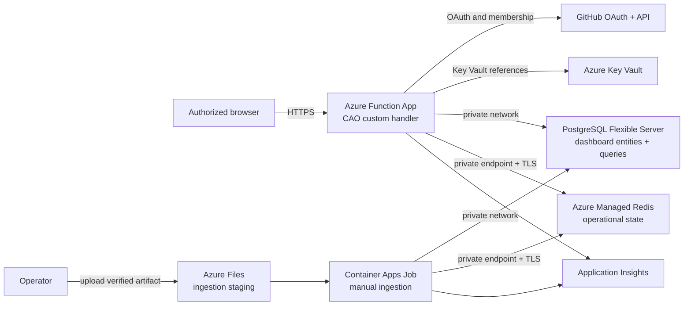

> [!WARNING]
> **Experimental:** This deployment is a staging-ready reference, not a certified production service. It creates a coherent private data path, deterministic packaging, repeatable ingestion, and validation commands. Your organization must still review availability, compliance, privacy, networking, monitoring, cost, backup, incident response, and recovery requirements before serving real users.

## Architecture

The Azure deployment runs the Go dashboard server as an Azure Functions custom handler. The Function App is the public application boundary. PostgreSQL and Azure Managed Redis have public network access disabled and are reached through the deployment virtual network.



The default profile is intentionally split into two stages:

1. `bootstrap.bicep` creates the resource group Key Vault and grants the signed-in operator permission to load secrets.
1. `main.bicep` reads the PostgreSQL administrator password from Key Vault and creates the application stack.

This split lets you generate a GitHub OAuth secret after the vault exists without putting the secret in chat, source control, a parameter file, or an ARM deployment output.

## What the deployment creates

| Service | Configuration | Purpose |
| --- | --- | --- |
| Azure Functions | Linux custom handler on Elastic Premium `EP1`, HTTPS only, TLS 1.2, FTPS off, always on, user-assigned identity, VNet integration, route-all enabled | Hosts the CAO dashboard server |
| PostgreSQL Flexible Server | PostgreSQL 16, private delegated subnet, private DNS, public access disabled, `Standard_B1ms` and 32 GiB by default, seven-day backup retention | Stores authoritative dashboard entities and executes Dashboard Language queries |
| Azure Managed Redis | `Balanced_B0` by default, encrypted client protocol, TLS 1.2, `NoEviction`, RedisJSON and RediSearch, public access disabled, private endpoint and private DNS | Stores sessions, rate limits, queues, deduplication, coordination, quota state, and bounded caches |
| Azure Container Apps job | Internal environment, manual trigger, user-assigned identity, read-only Azure Files mount | Ingests a verified dashboard artifact without exposing PostgreSQL |
| Key Vault | RBAC, soft delete, optional purge protection, ARM template secret retrieval enabled | Stores OAuth, session, PostgreSQL, Redis, and Functions storage secrets |
| Storage account | HTTPS only, TLS 1.2, no public blob access | Stores Functions runtime state and the temporary ingestion artifact |
| Application Insights | Optional Log Analytics linkage | Receives Functions and ingestion telemetry |

The virtual network has separate subnets for Functions integration, PostgreSQL, Redis private endpoints, ingestion, and optional collection workers.

## Prerequisites

- An Azure subscription where you can create the listed resources, assign RBAC roles, and register providers.
- Azure CLI with Bicep and the Container Apps extension.
- `curl`, `go`, `jq`, Node.js, npm, OpenSSL, and `zip`.
- A GitHub OAuth app. Personal access tokens and GitHub App user tokens are not supported.
- At least one allowed GitHub organization or team in `ORGANIZATION/TEAM-SLUG` form.
- A verified dashboard artifact produced by the `cao-dashboard.yml` workflow.
- A published immutable CAO server image for ingestion. Use a `sha-<40-character-commit>` tag, not a mutable tag.

The OAuth app callback must be:

```text
https://FUNCTION-APP-NAME.azurewebsites.net/auth/callback
```

The deployment uses the reviewed `.github/workflows/cao.azure.json` profile. That profile extends `cao.json` only at `control-plane.web.host`, selects the `azure-functions` target, and selects the fixed `azure-managed-redis` provider with required TLS. It does not change campaign scope, mode, rollout, credentials, or target authority.

## Configure the deployment

Copy the non-secret example configuration outside source control:

```bash
mkdir -p .cao/azure
cp server/azure/config.example.json .cao/azure/config.json
```

Edit `.cao/azure/config.json`. The file contains names, location, authorization, and an immutable ingestion image. It must not contain secrets.

```json
{
  "subscriptionId": "00000000-0000-0000-0000-000000000000",
  "location": "eastus2",
  "resourceGroup": "rg-cao-dashboard-eus2",
  "functionAppName": "cao-example-unique",
  "storageAccountName": "stcaoexampleunique",
  "keyVaultName": "kv-cao-example-unique",
  "redisEnterpriseName": "redis-cao-example-unique",
  "postgresServerName": "psql-cao-example-unique",
  "githubClientId": "YOUR_GITHUB_OAUTH_CLIENT_ID",
  "githubAllowedOrganizations": [],
  "githubAllowedTeams": [
    "YOUR_ORGANIZATION/YOUR_TEAM_SLUG"
  ],
  "ingestionImage": "ghcr.io/githubnext/gh-aw-cao/cao-server:sha-YOUR_TRUSTED_COMMIT_SHA",
  "enablePurgeProtection": true
}
```

Keep purge protection enabled for retained environments. Set it to `false` only for a disposable test resource group that must be purged immediately after deletion.

## Review before creating resources

Run the local preflight:

```bash
scripts/azure/cao-azure.sh preflight .cao/azure/config.json
```

This command checks tools, Azure login, the selected subscription, required
resource-provider registrations, the Container Apps CLI, resource-name
constraints, the OAuth callback, authorization policy, and image pin. It does
not create Azure resources.

Review these files before continuing:

- `.github/workflows/cao.azure.json`
- `server/azure/bootstrap.bicep`
- `server/azure/main.bicep`
- `server/azure/postgres.bicep`
- `server/azure/ingestion.bicep`
- `scripts/azure/cao-azure.sh`
- Your `.cao/azure/config.json`

`bootstrap` is the first command that creates Azure resources.

## Bootstrap Key Vault and secrets

Run:

```bash
scripts/azure/cao-azure.sh bootstrap .cao/azure/config.json
```

The command:

1. Selects the configured subscription.
1. Creates the resource group.
1. Deploys the RBAC-enabled Key Vault.
1. Grants the signed-in user **Key Vault Secrets Officer**.
1. Prompts for the GitHub OAuth client secret without echoing it when the secret does not already exist.
1. Generates the session secret and PostgreSQL administrator password when they do not already exist.
1. Writes all three values directly to Key Vault through temporary mode-`0600` files.
1. Removes the temporary files on success or failure.

The configuration file and ARM deployment contain no secret values.
Re-running bootstrap is idempotent and does not rotate existing credentials.

The vault enables ARM template secret retrieval because `main.bicep` passes the
PostgreSQL administrator password directly into the nested PostgreSQL module by
using `getSecret()`. The deployment principal must already have deployment
authority on the resource group. The secret remains a secure parameter and is
not written to deployment history or outputs.

The vault contains:

| Secret | Created by | Purpose |
| --- | --- | --- |
| `github-oauth-client-secret` | Bootstrap command | GitHub OAuth authorization-code exchange |
| `cao-session-secret` | Bootstrap command | Server-side OAuth session encryption |
| `cao-postgres-admin-password` | Bootstrap command | PostgreSQL creation and connection URL generation |
| `cao-postgres-url` | Main Bicep deployment | Versionless Function and ingestion reference |
| `cao-redis-url` | Main Bicep deployment | TLS Redis URL generated from the created database access key |
| `azure-webjobs-storage` | Main Bicep deployment | Functions runtime storage |

## Validate and review the Azure change

After bootstrap, run:

```bash
scripts/azure/cao-azure.sh validate .cao/azure/config.json
```

The command first runs `az deployment group validate`, then prints `az deployment group what-if`. It does not apply the main deployment. Review the what-if output for:

- The expected resource group and region.
- The Function App, EP1 plan, PostgreSQL, Redis, VNet, private endpoint, DNS zones, storage, Key Vault secrets, Application Insights, and ingestion job.
- No unexpected role assignments, public database access, or resources outside the configured resource group.
- The expected SKUs and storage sizes.

## Obtain a dashboard artifact

Complete the [GitHub Actions only deployment](deployment-actions.md) in the control repository and download a successful `cao-dashboard.yml` artifact. Verify the workflow run, repository, commit, and artifact provenance before ingestion.

Extract the artifact into a directory. The ingestion command uploads the directory contents to the deployment's `dashboard-ingest` file share, mounts the share read-only, and transactionally replaces the PostgreSQL dataset. A failed ingestion leaves the previous committed dataset active.

## Deploy and test

To run the reviewed main deployment and the complete application flow:

```bash
scripts/azure/cao-azure.sh deploy \
  .cao/azure/config.json \
  /ABSOLUTE/PATH/TO/VERIFIED-DASHBOARD-ARTIFACT
```

The command runs these phases in order:

1. ARM validation and what-if.
1. Private application infrastructure deployment.
1. Deterministic dashboard and Linux AMD64 Functions package build.
1. Azure Functions zip deployment.
1. Artifact upload.
1. Private Container Apps ingestion job.
1. Health, readiness, and OAuth redirect checks.

The package command temporarily configures npm to use
`https://packagefeedproxy.microsoft.io/npm/` before restoring dashboard
dependencies. If npm is configured with an unreachable loopback proxy, the
command temporarily removes that proxy for the restore and then restores the
original npm proxy and registry settings. Packaging requires a clean Git
worktree so the embedded revision identifies the exact deployed source.

You can run each phase independently:

```bash
scripts/azure/cao-azure.sh infrastructure .cao/azure/config.json
scripts/azure/cao-azure.sh package .cao/azure/config.json
scripts/azure/cao-azure.sh publish .cao/azure/config.json
scripts/azure/cao-azure.sh ingest .cao/azure/config.json /ABSOLUTE/PATH/TO/ARTIFACT
scripts/azure/cao-azure.sh verify .cao/azure/config.json
```

The package is written to `.cao/azure/cao-functions.zip`, which is ignored by Git.

## Complete the interactive acceptance test

The automated verification checks:

- `GET /api/health`
- `GET /api/readiness`
- `/auth/login` redirects to GitHub OAuth

Complete these checks in a browser:

1. Sign in as an active member of an allowed organization or team.
1. Open several dashboard views and confirm the expected artifact data appears.
1. Refresh a view and confirm the query result remains available.
1. Sign out and confirm the session is revoked.
1. Use a GitHub account outside the allow list and confirm access is denied.

Do not treat the deployment as accepted until the authorization-denial check has been performed with a genuinely unauthorized account.

## Configuration reference

The main template configures these application settings:

| App setting | Source |
| --- | --- |
| `CAO_DASHBOARD_HOSTING` | Fixed `azure-functions` |
| `CAO_POLICY_PATH` | Fixed `.github/workflows/cao.azure.json` |
| `CAO_AZURE_ALLOWED_HOSTS` | Configured Function App host |
| `CAO_AZURE_DASHBOARD_QUERIES` | Packaged `site/src/agent/queries.generated.json` |
| `CAO_DATABASE_QUERIES` | Packaged `queries/database.json` |
| `CAO_POSTGRES_URL` | Versionless Key Vault reference |
| `CAO_REDIS_URL` | Versionless Key Vault reference |
| `CAO_REDIS_NAMESPACE` | Fixed `azure-dashboard` |
| `CAO_GITHUB_CLIENT_ID` | Non-secret configuration |
| `CAO_GITHUB_CLIENT_SECRET` | Versionless Key Vault reference |
| `CAO_GITHUB_REDIRECT_URL` | Derived Function App callback |
| `CAO_GITHUB_ALLOWED_ORGS` | Configured organization allow list |
| `CAO_GITHUB_ALLOWED_TEAMS` | Configured team allow list |
| `CAO_SESSION_SECRET` | Versionless Key Vault reference |
| `APPLICATIONINSIGHTS_CONNECTION_STRING` | Application Insights |
| `AzureWebJobsStorage` | Versionless Key Vault reference |

Set `usePreviousSessionSecret=true` in a direct Bicep deployment only after creating `cao-session-secret-previous` in Key Vault for a controlled rotation.

## Monitoring

Functions host telemetry goes to Application Insights. If `logAnalyticsWorkspaceResourceId` is supplied to a direct Bicep deployment, Container Apps system and console logs are also sent to that workspace.

The Go server uses OpenTelemetry and emits request, query, and ingestion spans. To export Go spans to Azure Monitor, provide an OTLP collector with the Azure Monitor exporter and configure the standard `OTEL_EXPORTER_OTLP_*` settings as Key Vault-backed app settings.

Useful checks:

| Check | Meaning |
| --- | --- |
| `GET /api/health` | Process liveness |
| `GET /api/readiness` | PostgreSQL data is available for serving |
| Container Apps job execution status | Ingestion completed or failed explicitly |
| Application Insights failures | Functions host or application errors |
| PostgreSQL metrics | Connections, storage, CPU, and query pressure |
| Redis metrics | Memory, operations, connections, and errors |

## Optional collection profile

The default profile ingests artifacts produced by GitHub Actions. The optional collection profile remains an alternative, not an additional ingestion path.

To enable it in a direct `main.bicep` deployment:

1. Put the GitHub App private key in Key Vault as `cao-collect-private-key`.
1. Put the webhook secret in Key Vault as `cao-github-webhook-secret`.
1. Set `collectorImage`, `collectorGithubAppId`, `collectorControlRepository`, and the admin users.

The deployment creates a separate internal Container Apps environment on its own subnet. The Redis autoscaler password is generated from the deployed Redis database and stored in Key Vault. The Function App admits and queues signed webhooks but does not receive the GitHub App private key.

Use either the default artifact-ingestion profile or the collection profile. Do not configure both source modes in the server.

## Rotation and rollback

| Task | Procedure |
| --- | --- |
| Rotate OAuth secret | Add a new version of `github-oauth-client-secret`, restart the Function App after the Key Vault reference refreshes, and revoke the old OAuth secret after validation |
| Rotate session secret | Copy the old value to `cao-session-secret-previous`, write the new `cao-session-secret`, deploy with `usePreviousSessionSecret=true`, wait for old sessions to drain, then remove the previous setting |
| Rotate PostgreSQL password | Change the server administrator password and replace `cao-postgres-url` in the same maintenance window |
| Rotate Redis key | Regenerate an Azure Managed Redis database key and replace `cao-redis-url`; if collection is enabled, also replace `cao-redis-password` |
| Roll back application code | Zip-deploy the last known-good Functions package; schema and secret changes require their own compatible rollback plan |
| Rebuild dashboard data | Re-run `ingest` with the last verified artifact |

Versionless Key Vault references allow ordinary secret-version rotation without rewriting app settings. Restart the Function App when you need the new version to take effect immediately.

## Cleanup

For a disposable environment:

```bash
scripts/azure/cao-azure.sh destroy .cao/azure/config.json --yes
```

The command requests resource group deletion. If purge protection was disabled in the configuration, it waits for deletion and requests a Key Vault purge so the vault name can be reused.

Purge protection cannot be bypassed. A protected vault remains recoverable for its retention period after resource group deletion.

## Remaining production decisions

This reference deliberately does not claim:

- Multi-region availability or automatic regional failover.
- A web application firewall or Azure Front Door.
- Private ingress to the Function App.
- Customer-managed keys.
- Tenant-specific Azure Policy, Defender, diagnostic retention, or SIEM integration.
- Point-in-time operational recovery objectives beyond the configured PostgreSQL backup retention.
- Automatic scheduled artifact retrieval and ingestion.
- Per-repository authorization inside one dashboard dataset.
- Low idle cost. EP1 and Azure Managed Redis are provisioned services.

Make those decisions explicitly for the tenant rather than hiding them behind deployment defaults.
